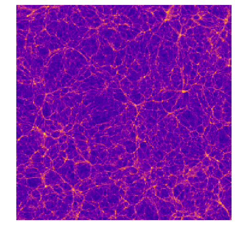
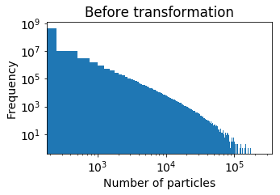
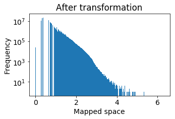
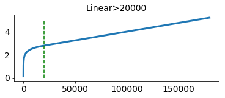
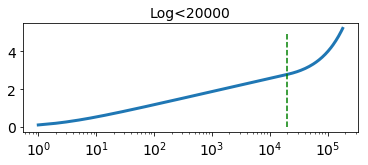
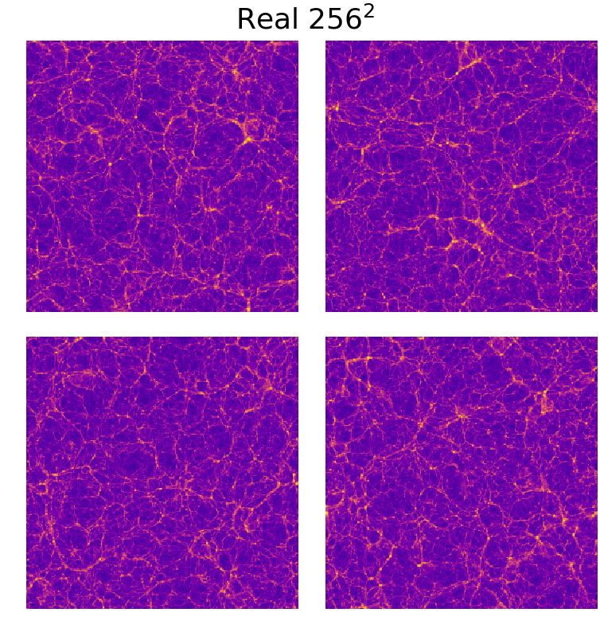
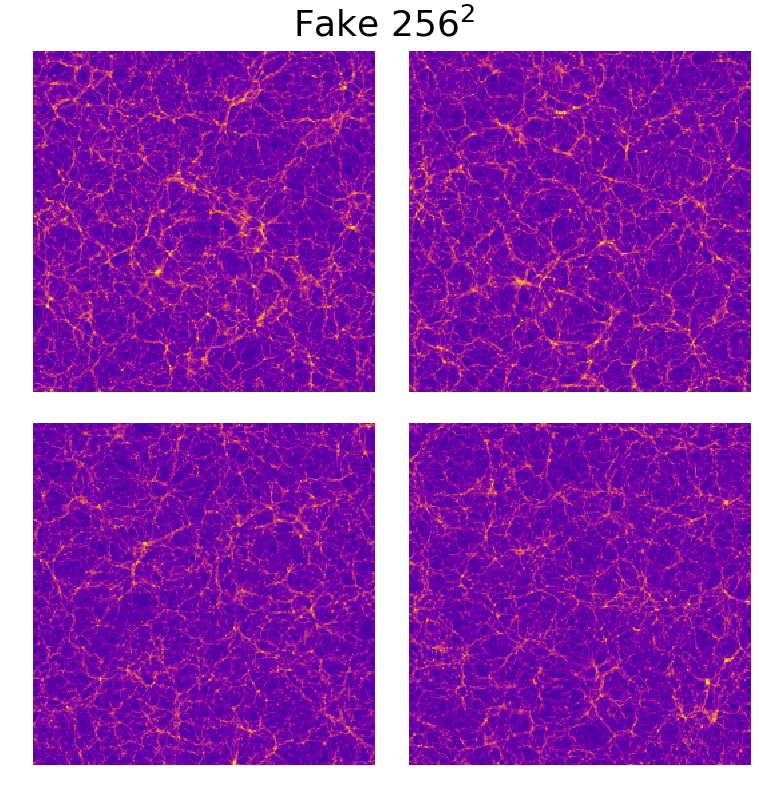

# 3Dcosmo: a benchmark dataset for large 3-dimensional generative models (and 2-dimensional as well)

[Nathanaël Perraudin][nath], Ankit Srivastava, [Tomasz Kacprzak][tomek], [Aurelien Lucchi][aurelien], [Thomas Hofmann][thomas], [Alexandre Réfrégier][alex]

[nath]: https://perraudin.info
[tomek]: http://www.ipa.phys.ethz.ch/people/person-detail.MjEyNzM5.TGlzdC82NjQsNTkxMDczNDQw.html
[aurelien]:http://people.inf.ethz.ch/alucchi/
[thomas]:http://www.da.inf.ethz.ch/people/ThomasHofmann/
[alex]:https://cosmology.ethz.ch/

This repository contains the code to take part in the 3DCosmo benchmark. The idea is to use generative models to generate replications of N-Body simulation images. You will find here: baselines for the 2D and 3D case, as well as a pipeline and a score to evaluate your model.

This code is assotiated with the paper *[Cosmological N-body simulations: a challenge for scalable generative models][linkpaper]*  that focuses mostly on scaling GAN to very large samples ( 256x256x256 pixels). 

[linkpaper]:https://arxiv.org/abs/1908.05519

## Installation

For a local installation, follow the instructions below.

1. Clone this repository.
   ```sh
   git clone https://github.com/nperraud/3DcosmoGAN
   cd cosmotools
   ```
2. Initialize all the submodules (submodules are git repositories within the git repositories).
	```sh
	git submodule update --init --recursive
	```


### Required packages

*We highly recommend working in a virtual environment.*

You can simply install those packages with the following command:
	```
	pip install -r requirements.txt
	```
or if you have no gpu:
	```
	pip install -r requirements_nogpu.txt
	```

For some operations, you may require `pynbody` as it was used to preprocess the simulation. If so, you need to install it separately.


## Dataset

The dataset consists of 30 N-body simulations at a scale of 500 MPch and 10 simulations at a scale of 100 Mpch. The dataset is available on Zenodo at: 
https://zenodo.org/record/1464832

The dataset does not contain the Nbody simulations as they have a very large size. Instead, we sliced the space into 256 x 256 x 256 cubic areas and counted the number of particles in each area. The result consists of 3D histograms, where the number of particles is a proxy for matter density.

N-body simulation evolves a cosmological matter distribution over time, starting from soon after the Big Bang.
It represents matter density distribution as a finite set of massive particles, typically order of trillions.
The positions of these particles are modified due to gravitational forces and expansion of the cosmological volume due to cosmic acceleration.
N-body simulations use periodic boundary condition, where particles leaving the volume on one face enter it back from the opposite side.

To download the dataset, you can simply execute the code:
```sh
python download_nbody.py
```

This script will download the data in the folder `data/nbody/preprocessed_data/` as a list of h5 files. You can then use the function `load_samples_raw` or `load_nbody_dataset` from `cosmotools/data/load.py` to access it easily.

Warning the all evaluation pipeline is tuned for the 500MPch dataset. If you want to use the 100Mpch cubes, the evaluation and the scores need to be adapted.

3D visualization           |  A slice of the cube
:-------------------------:|:-------------------------:
  |  


## Processing the simulations

The first step of the preprocessing is to compute the mass density of particles for each some division of the volume. This step is already done and you can directly access the cubes. The code used to do this is located at `cosmotools/data/generate_cosmo_dataset.py`. We split the cube into 256 x 256 x 256 sub-volumes.

**The second step is very important and should be carefully handled.** 
Because of the physical law of gravity, most of the universe is empty, while most of the matter is concentrated in a few small areas and filaments.
As a result, the distribution of pixel values of our 3-D histogram is significantly skewed towards the smaller values and has an elongated tail towards the larger ones. 
 
Histogram of the original cubes          |  Histogram of the mapped cubes
:-------------------------:|:-------------------------:
 | 

The file `cosmotools/data/fmap.py` contains a few functions to perform this mapping. In this work, we used the mapping function `stat_foward` and the inverse mapping function `stat_backward` with parameter `c=2e4` and `shift=1`. 

Forward transformation (linear scale)         |  Forward transformation (log scale)    
:-------------------------:|:-------------------------:
 | 

Reminder: **Before computing the score, the data need to be remapped to its initial domain.**


## Training and evaluation (3D)
The training of the model is done using the script found in the folder `nbody-3D`. You can use `nbody-0-32.py`, `nbody-32-64.py`, `nbody-64-256.py` to train the three scales used in the paper.
These scripts will create checkpoints and tensorboard summaries in the folder `saved_results`. The evaluation is then done using the notebook `generate_sample_3d.ipynb` in the folder `notebooks`. You will need to choose manually good checkpoints in order to get the best results.

Alternatively, you can avoid training the model and download the checkpoints on https://zenodo.org/record/3257564

The easiest way is to use the script: `download_checkpoints.py`.
```sh
python download_checkpoints.py
```

**Obtained scores for 3D**

|                | Score |
|----------------|-------|
| PSD            | 1.58  |
| Mass histogram | 0.63  |
| Peak histogram | 8.17  |

Check the samples in video [here](https://www.youtube.com/watch?v=nWXP6DVEalA).

## Training and evaluation (2D)
While the paper focuses on the 3d case, we also made some benchmark in 2D. To train our base architecture, you can use the scripts in the folder `nbody-2d`. To launch the training for a GAN generating images of size 128, you can use
```sh
python experiment.py 128
```
The script works for the size 32,64,128,256 but can trivially be adapted to any size.

The evaluation is done with the notebook: `results_2d.ipynb` from the folder `notebooks`.

**Obtained scores for 2D**

| Size                 | 32x32 | 64x64 | 128x128 | 256x256 |
|----------------------|:-----:|:-----:|:-------:|:-------:|
| PSD score            | 9.24  | 5.08  | 5.27    | 3.36    |
| Mass histogram score | 7.44  | 5.56  | 4.37    | 5.66    |
| Peak histogram score | 3.25  | 1.09  | 0.89    | 1.22    |
 
Can you differentiate | between real and fake?|
:-------------------------:|:-------------------------:
 | 

## Example
The best way to get started is to start with this [this demo notebook](https://github.com/nperraud/CodeGAN/blob/master/WGAN%20demo.ipynb)

## Contributors

The main contributor is Perraudin Nathanaël. He was helped by Rosenthal Jonathan, Srivastava Ankit and Sandro Marcon. Some of the code is based on the work of Andres Rodriguez Escallon ([this repository][repository]).

[repository]:https://github.com/dalab/msc_andres

## License & citation

The content of this repository is released under the terms of the [MIT license](LICENCE.txt).
Please consider citing our papers if you use it.

```
@inproceedings{perraudin2019cosmological,
  title = {Cosmological N-body simulations: a challenge for scalable generative models},
  author = {Nathana\"el, Perraudin and Ankit, Srivastava and Kacprzak, Tomasz and Lucchi, Aurelien and Hofmann, Thomas and R{\'e}fr{\'e}gier, Alexandre},
  year = {2019},
  archivePrefix = {arXiv},
  eprint = {1908.05519},
  url = {https://arxiv.org/abs/1908.05519},
}
```


